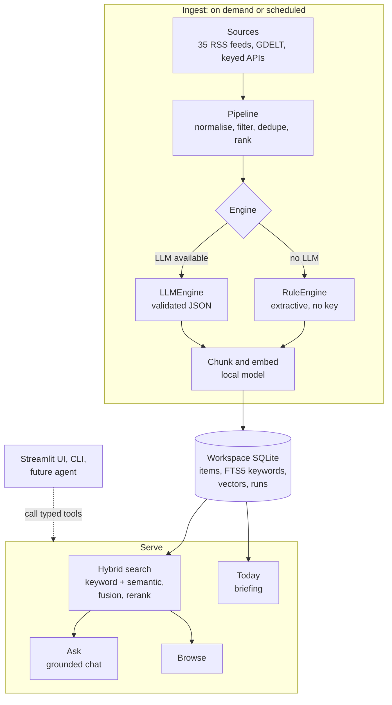
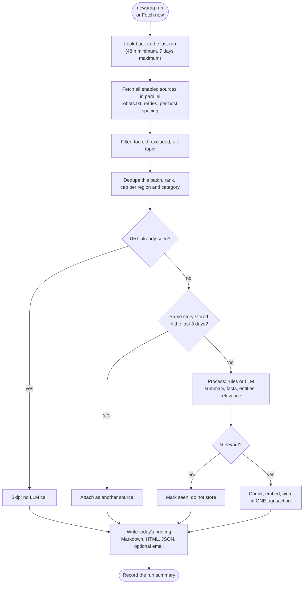
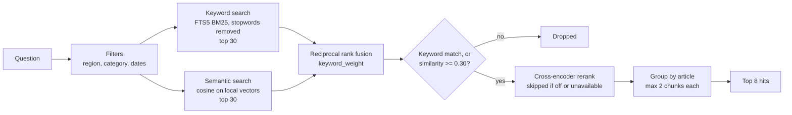
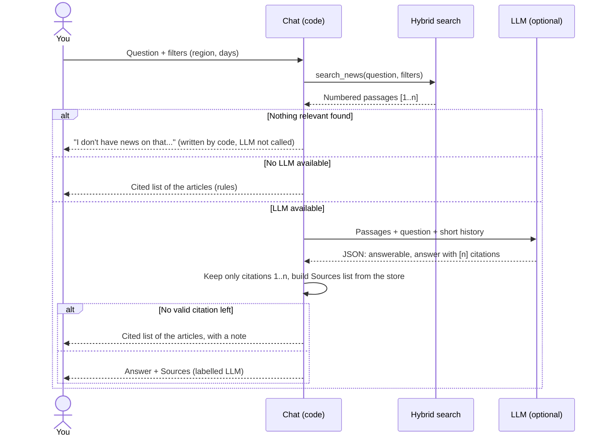
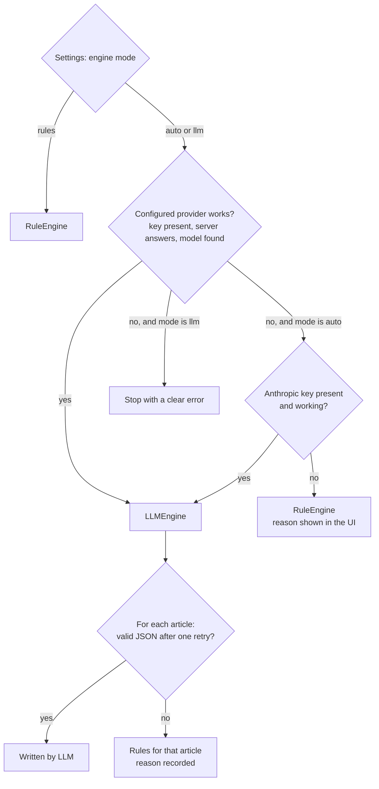
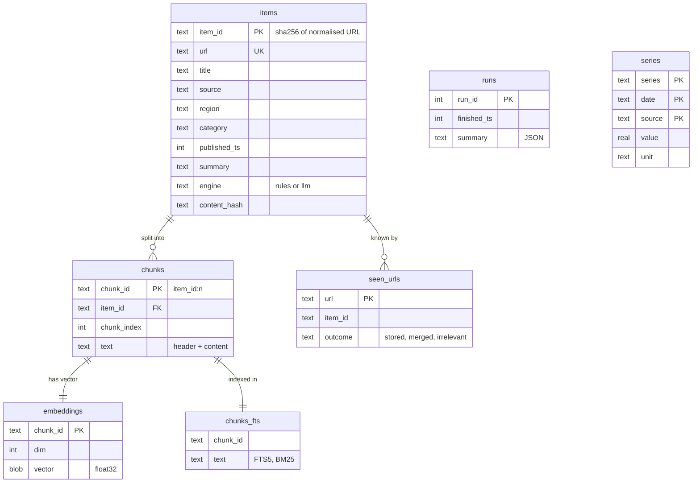
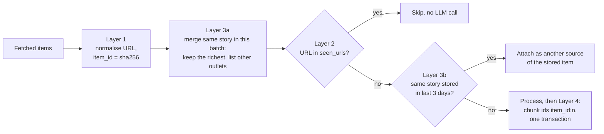

# Daily News Intelligence (Hybrid): Architecture and Tool Choices

This document explains **how the app is put together, which tools it uses, why each was chosen, and what we gain**.
`REQUIREMENTS.md` says *what* to build. This says *why it is built this way*.

## 1. Design principles
| Principle | What it means | Benefit |
|-----------|---------------|---------|
| Works with zero keys | Every stage has a pure-Python path | Anyone can run it free, offline, on day one |
| LLM is an upgrade, not a dependency | Same pipeline, `RuleEngine` or `LLMEngine` | Better text when available, never broken when not |
| Code decides, LLM writes | Filters, dedupe, ranking, dates, numbers are code | Reproducible, testable, cheap; no invented numbers |
| Local first | One workspace folder, local DB, local models | Privacy, portability, no servers to run |
| Small and replaceable parts | One interface per seam (source, engine, store, tool) | Swap a part without touching the rest; reuse for other data |
| Agent-ready | Core operations are typed, side-effect-labelled tools | Adding an agent later is a feature, not a rewrite |

## 2. System overview

### 2.1 One run, step by step

All operations above are exposed as **tools** (`newsrag/tools/`), which the UI, CLI and a future agent all call.

## 3. Layers and their responsibilities
| Layer | Responsibility | Key interface |
|-------|----------------|---------------|
| Sources | Fetch items from one kind of source | `fetch(since) -> list[Item]` |
| Pipeline | Normalise, filter, dedupe, rank, chunk | Pure functions, fully unit-tested |
| Engines | Turn items into summaries, answers, digests | `Engine.process / answer / briefing` |
| Store | Persist items, chunks, keyword index, vectors, runs | One `Store` class over one SQLite file |
| Retrieval | Hybrid search, fusion, rerank, grouping | `search_news(...)` tool |
| Tools | Typed operations for UI, CLI, agent | Registry with JSON schemas |
| UI / CLI | Present and trigger; no business logic | Streamlit pages, `python -m newsrag` |

## 4. The RAG design: hybrid search with reranking
### 4.1 Steps
1. **Filter first** by region, category and date inside both searches.
2. **Keyword search** (SQLite FTS5, BM25), top 30.
3. **Semantic search** (vector similarity), top 30.
4. **Reciprocal rank fusion** merges the two lists by rank position.
5. **Cross-encoder rerank** re-scores the fused candidates against the question.
6. **Relevance floor:** drop candidates that only the vector search found with similarity below `min_similarity` (0.30). Without it, any question returns the nearest articles and "no news on that" can never trigger.
7. **Group by article**, at most 2 chunks each, cut to `top_k` (8).

### 4.2 Why this design
| Choice | Why | Benefit |
|--------|-----|---------|
| Filter before search | News questions are about time and place | No out-of-range results; fixes the n8n version's post-filter gap |
| Keyword (BM25) | News is full of exact names, tickers, numbers, bill names | Exact matches that embeddings blur are still found |
| Semantic | Same story is told in different words | Paraphrased questions still find the story |
| RRF fusion | BM25 and cosine scores are on different scales | Merges by rank, needs no score tuning, robust |
| Cross-encoder rerank | Reads question and passage together, more accurate than either search alone | Better top results, so better answers and digests; runs locally |
| Group by article | Long articles produce many similar chunks | Answers cite more distinct sources |
| Chunk headers (headline, date, source, URL inside each chunk) | Chunks are retrieved alone | Every chunk is citable and dateable by itself |
| Relevance floor on similarity, not rerank | Vector search always returns neighbours; the cross-encoder scores relevant passages near zero for short keyword queries (seen live) | "No news on that" is decided by code, and relevant results for terse queries are not lost |
| Code-validated citations and code-built links (chat and digest) | Models can cite the wrong number or invent a URL | Every link shown came from the store; uncited answers fall back to the article list |

### 4.3 Alternatives considered
| Option | Why not (for v1) |
|--------|------------------|
| Vector-only RAG | Misses exact terms; what the n8n version used |
| GraphRAG | Heavy to build, needs an LLM to extract the graph, fails the zero-key goal |
| Agentic RAG | Planned later (REQUIREMENTS §12); fixed retrieval is faster and predictable for v1 |
| Parent-child chunking | News items are short, often snippets; little gain |
| Hosted vector DB (Qdrant cloud, Pinecone) | Adds an account, a key and network dependency for a single-user app |

### 4.4 Cost of the choice
- Reranking adds CPU time per question (roughly proportional to `candidates_k`). It can be switched off, and `candidates_k` lowered, in Settings.
- Two indexes (FTS5 + vectors) must stay in sync. The store owns both and updates them together, and "Verify integrity" checks them.

### 4.5 Grounded chat, end to end

## 5. Tool and library choices
| Area | Tool | Why chosen | Benefit | Alternatives considered |
|------|------|-----------|---------|-------------------------|
| Language | Python 3.11+ | Best ecosystem for feeds, NLP, embeddings, LLM SDKs | One language end to end, incl. UI | Node (weaker local NLP) |
| UI | Streamlit (`st.navigation`, segmented controls, chat, data editor); theme and text size applied with CSS variables | Pure Python, fast to build, built-in chat, tables, progress | No frontend skills needed; colleagues can extend it; every page is a thin layer over tested functions | React (more work), Gradio (less suited to multi-page apps) |
| HTTP | `httpx` + `tenacity` | Async, timeouts, clean retry with backoff | Parallel fetch; one bad feed never stalls the run | `requests` (sync only) |
| Feeds | `feedparser` | Mature, handles messy real-world RSS and Atom | Fewer parsing failures | Hand-written XML parsing |
| Full text (optional) | `trafilatura` | Strong article extraction | Richer summaries when allowed | `newspaper3k` (less maintained) |
| Dedupe | Jaccard overlap of significant headline words (stdlib) | Simple, explainable, no dependency; a few thousand items a day is well within its speed | Same story from 5 outlets becomes 1 item with "also reported by" | `rapidfuzz` (considered; its token-set scores over-merge short headlines) |
| Data models | `pydantic` v2 | Typed models, validation, JSON schema export | Validates LLM JSON; generates tool schemas for agents | dataclasses (no validation) |
| Config | YAML (`pyyaml`) | Human-editable | Colleagues add feeds without code | JSON (harder to hand-edit) |
| Database | SQLite | Built in, single file, zero setup, FTS5 included | Portable workspace, backups are a file copy | Postgres (needs a server) |
| Keyword search | SQLite FTS5 | Already in SQLite, BM25 ranking | Hybrid search at no extra cost | Elasticsearch, Whoosh |
| Vector store | Vectors as float32 BLOBs in the same SQLite file; brute-force cosine in `numpy` after SQL metadata filters | One transaction covers row, chunks, keyword index and vectors; no sync problem; no extra dependency | Crash-safe ingest, one-file backups, filters applied before search | Chroma, LanceDB (considered first; a second store needs cross-store consistency), Qdrant (server), FAISS (no metadata filters) |
| Embeddings | `sentence-transformers` (`all-MiniLM-L6-v2`) or Ollama (`nomic-embed-text`) | Free, local, small, good quality | Works offline with zero keys | Hosted embeddings (key, cost, data leaves machine) |
| Rerank | `CrossEncoder` (`ms-marco-MiniLM-L-6-v2`) | Small, fast, well-known reranker; same library as embeddings | Better precision with no new dependency | Hosted rerank APIs (key, cost) |
| Rule-based NLP | Standard-library extractive rules | Lead-sentence summaries, numeric key facts, capitalisation-based entities; nothing invented | Useful output in zero-key mode with no model downloads | `sumy` TextRank, `spaCy` (heavier; can be added behind the same `Engine` interface) |
| Hosted LLMs | Official `anthropic` SDK for Claude; `httpx` for Gemini and OpenAI-compatible APIs | Claude: structured outputs guarantee schema-valid JSON, per-task effort (`low` for tagging, `medium` for chat/digest), server-side refusal fallbacks. Others: one small client each | Best quality text when a key exists; one interface (`LLMClient`) for all providers | Provider SDKs for every vendor (more dependencies) |
| Local LLMs | Ollama, OpenAI-compatible local servers via `httpx` | Popular, simple, no key, private | Full offline mode with LLM quality | Hard-coding one runtime |
| Quality | `pytest`, `ruff`, `mypy`, `pre-commit` | Standard, fast | Catches regressions; consistent code across colleagues | — |
| Scheduling (optional) | cron, launchd, GitHub Actions | OS-native, no extra service | Automate later without code changes | Always-on scheduler process |

### 5.1 Decision: vectors in SQLite (changed during stage 4)
The first plan was Chroma or LanceDB next to SQLite. During the build we moved vectors into
the same SQLite file.

- **Why:** an article's row, chunks, FTS5 rows and vectors are now written in one SQLite
  transaction. A crash or error rolls back all of them, so the indexes cannot disagree
  (REQUIREMENTS DD4). With two stores this needs compensating deletes and repair logic.
- **Scale check:** 90 days of news is roughly 100k chunks x 384 floats, about 150 MB.
  Filtering in SQL and scoring the remaining vectors in numpy takes milliseconds.
- **Trade-off:** brute-force search is linear in the number of chunks. Past a few million
  chunks, an approximate index (for example `sqlite-vec`, LanceDB or Qdrant) would be needed.
  `Store` hides this, so the change would be local.

## 6. Hybrid engine (rules or LLM)

**Benefits:** the app never fails because of an LLM; quality improves automatically when an LLM exists; every output is labelled with the engine that wrote it.

## 7. Data and storage model
| Store | Holds | Why |
|-------|-------|-----|
| `items` | One row per article: headline, URL, source, region, category, dates, summary, engine | Source of truth for Browse, digest, cleanup |
| `seen_urls` | URL and first-seen date | Idempotent ingest; kept after cleanup so old items are not re-fetched |
| `chunks` + `chunks_fts` | Chunk text with header, FTS5 index | Keyword search and citations |
| `embeddings` | Chunk vectors (float32 BLOB) keyed by `chunk_id` | Semantic search; deleted with their chunk |
| `runs` | Per-run summary as JSON, including failed sources and errors | Fetch page history, catch-up window, troubleshooting |
| `series` | `series, date, source, value, unit`; key `(series, date, source)` | Numeric data such as gold rates (not used by news in v1) |
| `meta` | Schema version | Refuse to open a database from a newer app |
| `sources.json` (file, not a table) | Your added sources and on/off choices | Safe editing; shipped `config.yaml` is never changed |

### 7.1 How duplicates are prevented
Order as in the code: the batch merge runs in the pipeline, the other checks in `ingest.py`.

| Design choice | Why | Benefit |
|---------------|-----|---------|
| Normalised URL hashed into the ID | Same article appears with tracking parameters and redirects | One article, one ID, everywhere |
| `UNIQUE` / `PRIMARY KEY` constraints | Code checks can race or have bugs; constraints cannot | Duplicates are impossible even if two runs overlap |
| Skip before processing | LLM calls cost time and money | Re-runs are cheap |
| Near-duplicate window with kept source links | Syndicated stories use different URLs | Cleaner results, and no source is lost |
| Deterministic chunk IDs + one transaction | Crashes and retries happen | Any step can be safely repeated, by a user or a future agent |
| Content hash | Publishers update articles | Updates are detected and handled by a setting, not by accident |
| Natural key per data type | Transcripts and price series have different identities | The same rule extends to new data without new dedupe logic |

The workspace also stores the schema version and embedding model name, so incompatible indexes are detected instead of silently mixed.

## 8. Security and privacy
| Concern | Design | Benefit |
|---------|--------|---------|
| API keys | Memory only, password field or env var, redacted in errors | Nothing secret on disk or in shared workspaces |
| Data location | Everything in the chosen workspace | User controls where data lives and who can see it |
| Fully private mode | Ollama + local embeddings + local rerank | No content leaves the machine |
| Source politeness | User-Agent, rate limits, caching, robots.txt | Avoids bans and respects publishers |
| Destructive actions | Preview, confirmation, backup offer | No accidental data loss |
| Agent safety (later) | Tools declare `changes_data`; those need confirmation | An agent cannot delete or fetch on its own |

## 9. Extensibility
| To add | Touch only |
|--------|-----------|
| A new feed | Sources page or `config.yaml` |
| A new source type (API, folder of transcripts) | One adapter in `sources/` |
| A new domain (call transcripts) | Adapter + domain prompt/rules in the engine |
| Numeric series (gold rates) | Adapter + `series` table + a chart page |
| A new LLM provider | One client in `engines/llm.py` |
| An agent | Agent loop over the existing tool registry |

## 10. Benefits summary
1. **Free and offline by default**, better with an LLM, never broken without one.
2. **Better retrieval than the n8n version**: exact terms, paraphrases and date filters all handled, then reranked.
3. **Trustworthy answers**: grounded, cited, labelled by engine; numbers come from code.
4. **Simple to run and share**: one folder, no servers, no accounts.
5. **Easy to extend**: new sources, domains, providers and an agent fit into existing seams.

## 11. Known trade-offs
- Rule-based summaries are weaker than LLM summaries.
- Local models are slower and less reliable at structured output.
- Reranking and local embeddings use CPU and download small models on first run.
- Free news APIs have quotas and can change terms; feed URLs need occasional maintenance.
